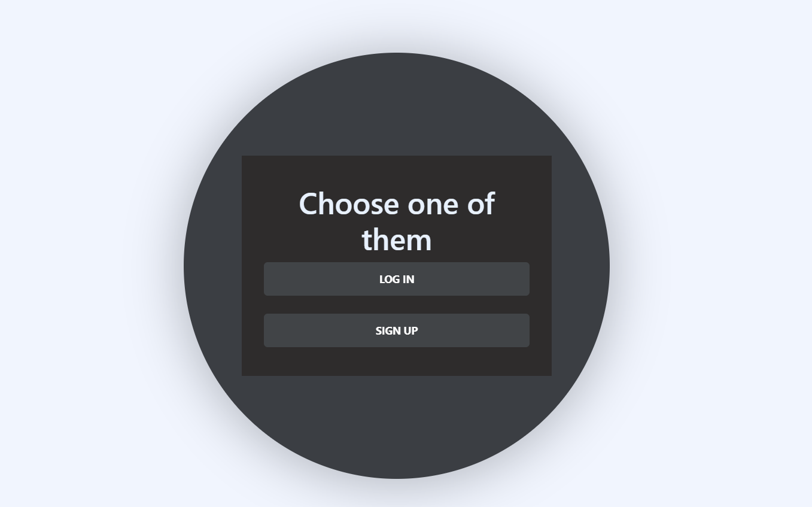
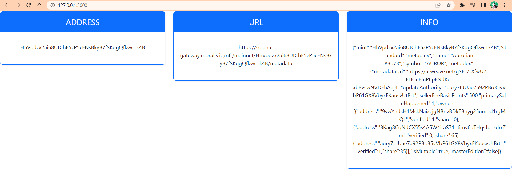

# Web Application for NFT
In this App you can find some information about NFT but first you have to register
_____________
# Installation
* Go through this link https://github.com/srkhnvd/assignment3.git and in python.py you should change this part of code: database="nftdb", user = "postgres", password = "32201510", host = "127.0.0.1", port = "5433" by your own database
* Also this part of code: database="users", user = "postgres", password = "32201510", host = "127.0.0.1", port = "5433" by your own database
* You should create venv: python -m venv venv
* Activate venv: .\venv\Scripts\activate
* Install: pip install -r requirements.txt
* Go to "src" directory: cd src
* Run my app: flask --app zxc.py run
_____________
# Example

_____________
# License
GNU General Public License v3.0